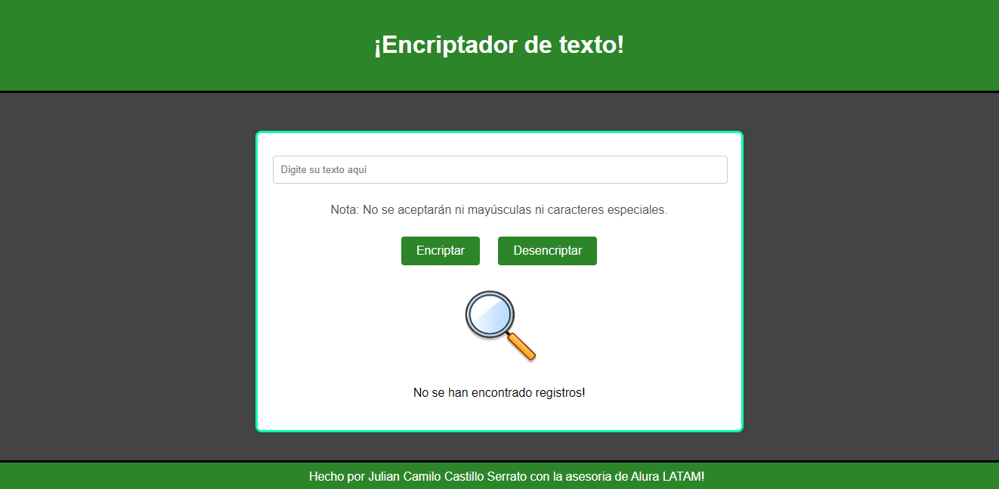

# Encriptador de Texto; Challenge de Alura

¡Bienvenido al Encriptador de Texto! Este programa permite encriptar y desencriptar mensajes de texto mediante un sencillo sistema de reemplazo de caracteres. La aplicación está desarrollada utilizando HTML, CSS y JavaScript.

Desarrollado por Julian Castillo.

## Descripción

Este encriptador de texto es una herramienta interactiva que permite transformar un texto dado aplicando reglas específicas de encriptación. Asimismo, la aplicación puede revertir el proceso para recuperar el texto original.

### Reglas de Encriptación

El programa utiliza las siguientes reglas para encriptar texto:

- La letra **"a"** se reemplaza por **"ai"**.
- La letra **"e"** se reemplaza por **"enter"**.
- La letra **"i"** se reemplaza por **"imes"**.
- La letra **"o"** se reemplaza por **"ober"**.
- La letra **"u"** se reemplaza por **"ufat"**.

El proceso de desencriptación simplemente invierte estas reglas, devolviendo el texto original.

### Restricciones

- No se permiten mayúsculas ni caracteres especiales. Solo se aceptan letras minúsculas y espacios.
- En caso de que se introduzca texto inválido, se mostrará un mensaje de error.

## Captura de Pantalla

## Tecnologías Utilizadas

- **HTML**: Estructura del contenido.
- **CSS**: Estilizado del diseño de la aplicación.
- **JavaScript**: Lógica de encriptación y desencriptación.

## Cómo Usar

Sigue estos pasos para utilizar la aplicación:

1. **Introducir Texto**: Escribe el texto que deseas encriptar o desencriptar en el campo de entrada.
   
2. **Encriptar**: Haz clic en el botón **"Encriptar"** para transformar el texto según las reglas de encriptación.
   
3. **Desencriptar**: Haz clic en el botón **"Desencriptar"** para revertir el proceso y recuperar el texto original.

4. **Copiar**: Una vez que el texto haya sido encriptado o desencriptado, puedes copiarlo al portapapeles haciendo clic en el botón **"Copiar"**.

## Instalación y Ejecución

Para ejecutar este programa en tu máquina local:

1. Clona este repositorio o descarga los archivos necesarios.

2. Asegúrate de que todos los archivos estén en el mismo directorio:
   - `index.html`
   - `style.css`
   - `app.js`
   - `img/` (directorio de imágenes, incluyendo `lupa.jpeg`)

3. Abre el archivo `index.html` en tu navegador web preferido.

4. ¡Comienza a encriptar y desencriptar texto!

## Desarrollado por:

### Con la ayuda de:

